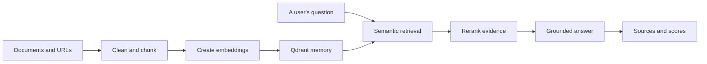

# Ragnarok — answers that remember where they came from

Most chatbots are confident even when they are wrong.

Ragnarok began with a simpler idea: what if an assistant answered only from the knowledge you gave it—and showed you exactly where every answer came from?

Give it a document, a URL, or a collection of notes. Ragnarok breaks that knowledge into searchable pieces, stores their meaning in a vector database, and brings the most relevant evidence back whenever someone asks a question. The result is not just an answer. It is an answer with a trail you can follow.

[**Talk to the live application**](https://rag-chatbot-waqar.onrender.com) · [Explore the API](https://rag-chatbot-api-waqar.onrender.com/docs) · [Check backend health](https://rag-chatbot-api-waqar.onrender.com/api/v1/health)

[](https://render.com/deploy?repo=https://github.com/Waqar-743/RAG_Chatbot)

## The journey of a question

Imagine uploading a research paper and asking, “What did the authors conclude?”

Ragnarok does not send that question straight to a language model and hope for the best. Instead, it follows a grounded path:

1. Your document is cleaned and divided into overlapping chunks.
2. OpenRouter turns each chunk into an embedding—a numerical representation of its meaning.
3. Qdrant stores those embeddings as the application’s searchable memory.
4. Your question is embedded and matched against that memory.
5. The strongest, most diverse passages are assembled as evidence.
6. The language model writes an answer from that evidence and returns the sources beside it.



When the evidence is too weak, Ragnarok says it does not have enough information. That refusal is part of the design, not a failure.

## What it feels like to use

- Drop in PDF, DOCX, Markdown, or plain-text content and index it from the browser.
- Paste a public URL and turn the page into searchable knowledge.
- Ask natural-language questions instead of writing search queries.
- See the source passages and similarity scores behind each response.
- Keep optional chat history and document metadata in MongoDB.
- Use the same system through the React interface or the FastAPI endpoints.

## Where the story runs

The production application is split into focused services:

| Responsibility | Service | Role |
| --- | --- | --- |
| Experience | Render Static Site | Serves the React and Vite frontend globally |
| Reasoning pipeline | Render Web Service | Runs FastAPI, indexing, retrieval, and generation |
| Searchable memory | Qdrant Cloud | Stores document vectors and performs semantic search |
| Optional history | MongoDB Atlas | Stores metadata and conversations when configured |
| Language intelligence | OpenRouter | Provides embeddings and chat completion |

Both Render services live in [`render.yaml`](render.yaml). The frontend receives the public backend address through `VITE_API_URL`, while the backend allows the frontend through an explicit CORS configuration. Every push to `main` is tested before Render deploys it.

## Make it yours

The fastest path is the **Deploy to Render** button at the top of this page. Render reads the Blueprint, creates the frontend and backend, and asks for the three secrets that cannot safely live in GitHub:

- `OPENROUTER_API_KEY`
- `QDRANT_URL`
- `QDRANT_API_KEY`

After the Blueprint finishes, verify the new service URLs shown in your Render dashboard. The included production deployment currently lives at:

- Frontend: <https://rag-chatbot-waqar.onrender.com>
- Backend: <https://rag-chatbot-api-waqar.onrender.com>
- API documentation: <https://rag-chatbot-api-waqar.onrender.com/docs>

MongoDB is optional. Add a valid `MONGO_URI` to the backend environment if you want persistent chat history and document metadata. Indexing and retrieval continue through Qdrant without it.

## Run the story locally

Start with the backend:

```powershell
python -m venv venv
.\venv\Scripts\Activate.ps1
pip install -r requirements.txt
Copy-Item .env.example .env
# Add your OpenRouter and Qdrant credentials to .env
python main.py
```

Then open a second terminal for the frontend:

```powershell
Set-Location frontend
npm ci
npm run dev
```

The API starts at <http://localhost:8000>. The interface starts at <http://localhost:3000> and proxies local `/api/*` requests to FastAPI.

Your local `.env` is ignored by Git. Never commit API keys.

## The important configuration

The complete template is in [`.env.example`](.env.example). A production backend needs:

```env
OPENROUTER_API_KEY=...
QDRANT_URL=https://your-cluster.aws.cloud.qdrant.io
QDRANT_API_KEY=...
QDRANT_COLLECTION=rag_documents
```

The production frontend needs the public backend origin:

```env
VITE_API_URL=https://your-backend.onrender.com
```

## Inside the repository

```text
api/                  FastAPI routes and request/response models
config/               Environment settings and structured logging
rag/                  Chunking, indexing, retrieval, and storage providers
frontend/             React, Vite, and Tailwind interface
scripts/clear_data.py Destructive storage-cleanup utility
render.yaml           Render Blueprint for both production services
Dockerfile            Production backend container
tests/                Backend and integration test suite
```

The core code is intentionally separated from the hosting layer. You can replace the interface, call the API from another application, or move the services without rewriting the retrieval pipeline.

## Test before you trust

```powershell
pytest -v

Set-Location frontend
npm run build
```

The GitHub workflow runs the backend suite, TypeScript checks, and the frontend production build on every push to `main`.

## Starting over

If you want a completely empty knowledge base, the cleanup utility deletes the configured Qdrant collection and clears the application’s MongoDB collections when MongoDB is reachable:

```powershell
python scripts/clear_data.py --yes
```

This is permanent. Ragnarok recreates the Qdrant collection the next time indexing or statistics initialize the store.

## The next chapter

Ragnarok is useful anywhere answers need evidence: internal documentation, research libraries, policy manuals, support knowledge bases, course material, or personal notes.

Fork it, give it a body of knowledge, and teach it what it should know—not what it should pretend to know.

## License

MIT
